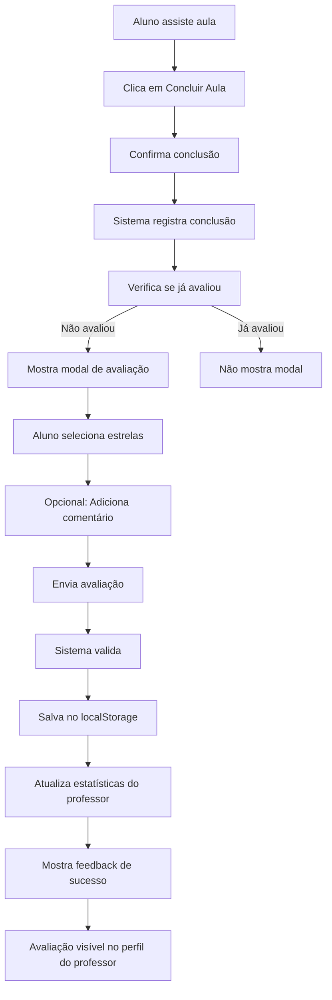

# Sistema de Avaliação de Professores ⭐

## Visão Geral

Sistema profissional de avaliação com estrelas (1-5) que permite aos alunos avaliar os professores após concluir uma aula. O sistema é integrado ao fluxo de conclusão de aulas e exibe as avaliações no perfil do professor.

## Características Principais

### 1. Interface Profissional ✨
- **Emojis substituídos por ícones SVG** em toda a interface de vídeos
- Design limpo e moderno com animações suaves
- Sistema de estrelas interativo e responsivo
- Feedback visual imediato ao avaliar

### 2. Modal de Avaliação 🌟
Aparece automaticamente após o aluno concluir uma aula:
- Sistema de 5 estrelas interativo com hover effects
- Labels descritivos (Muito ruim, Ruim, Regular, Bom, Excelente)
- Campo opcional para comentário (máx. 500 caracteres)
- Contador de caracteres em tempo real
- Opção "Avaliar depois" para não forçar avaliação

### 3. Regras de Negócio 📋
- **Uma avaliação por aluno/professor/aula**: Usuário só pode avaliar uma vez cada combinação
- **Apenas após conclusão**: Modal só aparece quando aula é concluída
- **Validação de estrelas**: Avaliação entre 1 e 5 estrelas obrigatória
- **Comentário opcional**: Aluno pode, mas não precisa, deixar comentário

### 4. Cálculo de Média ⚖️
```javascript
// Fórmula de cálculo
média = soma_de_todas_estrelas / total_de_avaliações

// Exemplo:
// 3 avaliações: 5 estrelas, 4 estrelas, 5 estrelas
// média = (5 + 4 + 5) / 3 = 4.67
```

### 5. Perfil do Professor 👨‍🏫
Exibe estatísticas completas de avaliação:
- **Média geral** com 1 casa decimal (ex: 4.7)
- **Estrelas visuais** com preenchimento parcial
- **Total de avaliações** 
- **Distribuição por estrelas** com barras de progresso animadas

## Estrutura de Arquivos

### JavaScript
```
public/js/
├── teacher-ratings.js     # Sistema principal de avaliações
├── videos.js              # Integração com modal de conclusão
└── profile.js             # Exibição no perfil do professor
```

### HTML
```
public/
├── videos.html            # Interface de vídeos (ícones SVG)
└── profile.html           # Perfil com seção de avaliações
```

### Database
```
database/
└── 06-teacher-ratings.sql # Tabela e funções SQL
```

## Uso

### Para Alunos

1. **Assistir aula completa**
2. **Clicar em "Concluir Aula"**
3. **Confirmar conclusão**
4. **Modal de avaliação aparece automaticamente**
5. **Selecionar de 1 a 5 estrelas**
6. **Opcional: Adicionar comentário**
7. **Enviar avaliação**

### Para Professores

**Ver avaliações no perfil:**
```
https://seu-site.com/profile.html?user=Nome%20do%20Professor
```

O perfil exibe:
- Card com média de avaliação nas estatísticas principais
- Seção detalhada com distribuição de estrelas
- Total de avaliações recebidas

## API JavaScript

### TeacherRatingSystem

```javascript
// Instância global
window.TeacherRatingSystem

// Verificar se usuário já avaliou
TeacherRatingSystem.hasUserRated(userEmail, teacherName, lessonId)
// Retorna: true/false

// Adicionar avaliação
TeacherRatingSystem.addRating(userEmail, teacherName, lessonId, videoId, stars, comment)
// Retorna: { success: boolean, message: string, rating?: object }

// Obter estatísticas do professor
TeacherRatingSystem.getTeacherStats(teacherName)
// Retorna: { avgRating, totalRatings, ratings: {1:x, 2:y, 3:z, 4:w, 5:v} }

// Obter todas avaliações de um professor
TeacherRatingSystem.getTeacherRatings(teacherName)
// Retorna: Array de objetos de avaliação

// Mostrar modal de avaliação
showTeacherRatingModal(teacherName, lessonId, lessonTitle, videoId)
```

## Armazenamento

### LocalStorage

```javascript
// Chave de avaliações
'ns-teacher-ratings'

// Estrutura de dados
[
  {
    id: timestamp,
    userEmail: "aluno@email.com",
    teacherName: "Professor Nome",
    lessonId: 101,
    videoId: 10101,
    stars: 5,
    comment: "Excelente aula!",
    createdAt: "2025-12-04T10:30:00.000Z"
  }
]

// Chave de estatísticas
'ns-teacher-stats'

// Estrutura de dados
{
  "Professor Nome": {
    avgRating: 4.67,
    totalRatings: 3,
    ratings: {
      1: 0,
      2: 0,
      3: 0,
      4: 1,
      5: 2
    }
  }
}
```

### Database (PostgreSQL/Supabase)

```sql
-- Tabela principal
CREATE TABLE teacher_ratings (
  id SERIAL PRIMARY KEY,
  user_id UUID REFERENCES users(id),
  user_email VARCHAR(255) NOT NULL,
  teacher_name VARCHAR(255) NOT NULL,
  lesson_id INTEGER NOT NULL,
  video_id INTEGER,
  rating INTEGER CHECK (rating >= 1 AND rating <= 5),
  comment TEXT,
  created_at TIMESTAMP DEFAULT NOW(),
  UNIQUE(user_email, teacher_name, lesson_id)
);

-- Funções disponíveis
calculate_teacher_avg_rating(teacher_name)  -- Retorna NUMERIC
get_teacher_rating_stats(teacher_name)      -- Retorna TABLE
```

## Estilos CSS

### Classes Principais

```css
.rating-modal-backdrop          /* Overlay do modal */
.rating-modal                   /* Container do modal */
.rating-stars                   /* Container das estrelas */
.rating-star                    /* Estrela individual */
.rating-star.active             /* Estrela preenchida */
.teacher-rating-card            /* Card de avaliação no perfil */
.teacher-rating-average         /* Número da média */
.rating-bar-row                 /* Linha de barra de distribuição */
.rating-bar-fill                /* Preenchimento da barra */
```

### Variáveis de Cor

```css
--rating-gold: #d4af37;         /* Cor dourada das estrelas */
--rating-gradient: linear-gradient(135deg, #d4af37, #f4d03f);
```

## Exemplos de Consultas SQL

```sql
-- Ver avaliações de um professor
SELECT * FROM teacher_ratings 
WHERE teacher_name = 'Mariana Silva' 
ORDER BY created_at DESC;

-- Estatísticas de um professor
SELECT * FROM get_teacher_rating_stats('Mariana Silva');

-- Professores com melhor avaliação (mín. 3 avaliações)
SELECT 
  teacher_name,
  calculate_teacher_avg_rating(teacher_name) as avg_rating,
  COUNT(*) as total_ratings
FROM teacher_ratings
GROUP BY teacher_name
HAVING COUNT(*) >= 3
ORDER BY avg_rating DESC;

-- Distribuição de estrelas
SELECT 
  rating,
  COUNT(*) as count,
  ROUND(COUNT(*) * 100.0 / SUM(COUNT(*)) OVER(), 2) as percentage
FROM teacher_ratings
WHERE teacher_name = 'Mariana Silva'
GROUP BY rating
ORDER BY rating DESC;
```

## Fluxo Completo



## Benefícios

✅ **Para Alunos:**
- Possibilidade de avaliar a qualidade do ensino
- Interface intuitiva e rápida
- Feedback anônimo e honesto

✅ **Para Professores:**
- Métricas claras de performance
- Feedback construtivo dos alunos
- Reconhecimento por bom trabalho
- Visualização pública da reputação

✅ **Para Plataforma:**
- Conteúdo de qualidade incentivado
- Professores engajados em melhorar
- Sistema de reputação confiável
- Dados para insights e melhorias

## Manutenção

### Adicionar nova validação
Edite `teacher-ratings.js`:
```javascript
addRating(userEmail, teacherName, lessonId, videoId, stars, comment) {
  // Adicione validações aqui
  if (sua_condicao) {
    return { success: false, message: 'Sua mensagem' };
  }
  // ...
}
```

### Modificar labels das estrelas
Edite `teacher-ratings.js`:
```javascript
const starLabels = {
  1: 'Seu novo label',
  2: 'Seu novo label',
  // ...
};
```

### Ajustar estilos
Os estilos estão inline no `teacher-ratings.js` dentro da tag `<style>`. Modifique conforme necessário.

## Troubleshooting

**Modal não aparece:**
- Verifique se `teacher-ratings.js` está carregado
- Confirme que `window.TeacherRatingSystem` existe
- Verifique console do browser para erros

**Avaliação não salva:**
- Verifique se usuário está autenticado
- Confirme que não já avaliou esta aula
- Verifique localStorage não está cheio

**Estatísticas não aparecem:**
- Confirme que `renderTeacherRatings()` é chamada
- Verifique se `userInfo.role === 'teacher'`
- Verifique se há avaliações para este professor

## Versão

**v1.0.0** - 2025-12-04
- Sistema completo de avaliações implementado
- Integração com perfil do professor
- Substituição de emojis por SVGs
- Documentação completa

---

Desenvolvido com ⭐ para a plataforma NewSong
